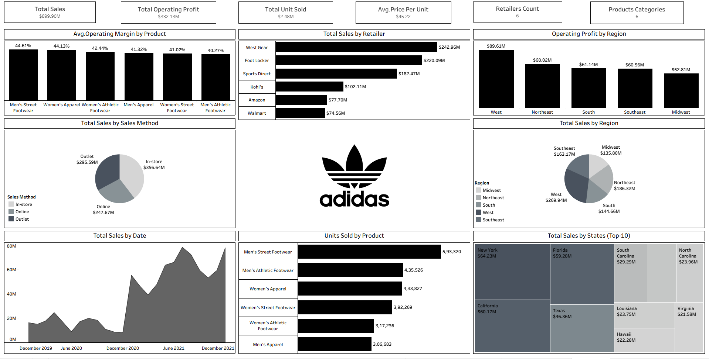

<div align="center">

# 📊 Adidas US Sales Performance Analytics Dashboard


<br>


</div>

---

## 🚀 Live Dashboard

<div align="center">

<a href="https://public.tableau.com/app/profile/kunal.sarkar6752/viz/tableauproject_17801483948660/Dashboard1?publish=yes">


</a>

</div>

---

## 📸 Dashboard Preview

<p align="center">

</p>

---

# 📈 Executive KPI Snapshot

| 💰 Total Sales | 📊 Operating Profit | 👟 Units Sold | 🏷️ Avg Price |
|:-------------:|:------------------:|:-------------:|:------------:|
| **$899.90M** | **$332.13M** | **2.48M** | **$45.22** |

---

# 🔥 Key Insights

<table>
<tr>
<td width="50%">

### 👟 Product Performance

✅ Men's Street Footwear  
**44.61% Margin**

✅ Women's Apparel  
**44.13% Margin**

</td>

<td width="50%">

### 🏪 Retail Leaders

🥇 West Gear  
**$242.96M**

🥈 Foot Locker  
**$220.09M**

</td>
</tr>
</table>

---

<table>
<tr>
<td width="50%">

### 🛒 Sales Channels

🏬 In-Store  
**$356.64M**

🏪 Outlet  
**$295.59M**

🌐 Online  
**$247.67M**

</td>

<td width="50%">

### 🌎 Regional Insights

🏆 West Region  
**$89.61M Profit**

🥇 New York  
**$64.23M Revenue**

🥈 California  
**$60.17M Revenue**

</td>
</tr>
</table>

---

# ⚙️ Tech Stack

<div align="center">

| Tool | Purpose |
|------|---------|
| Tableau Public | Dashboard Development |
| Microsoft Excel | Data Cleaning & Preparation |
| KPI Analytics | Business Performance Tracking |
| Data Visualization | Executive Reporting |

</div>

---

# 🎯 Analytics Workflow

```text
Raw Sales Data
      │
      ▼
 Excel Processing
      │
      ▼
 Data Cleaning
      │
      ▼
 Tableau Modeling
      │
      ▼
 KPI Analysis
      │
      ▼
 Interactive Dashboard
      │
      ▼
 Business Insights
```

---

# 📂 Repository Structure

```text
📦 Adidas-US-Sales-Dashboard
│
├── README.md
├── Adidas.xlsx
├── dashboard.png.png
└── tableau adidas.project.twb
```

---

<div align="center">

### ⭐ Transforming Data Into Business Decisions

Made with ❤️ using Tableau Public & Microsoft Excel

</div>
